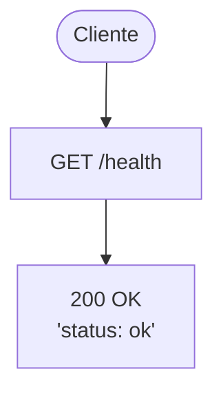
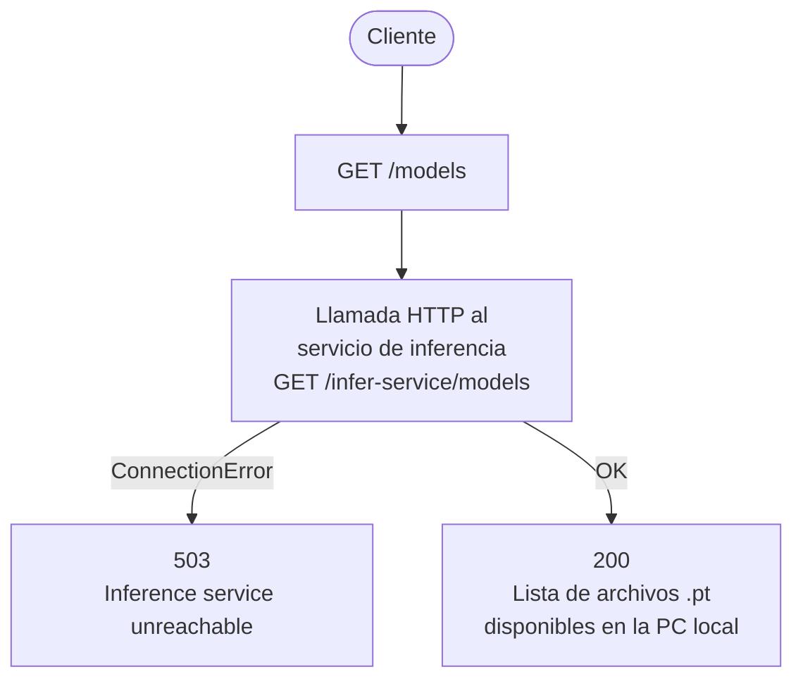
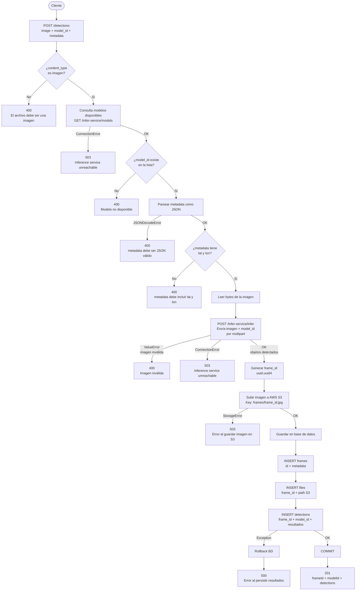
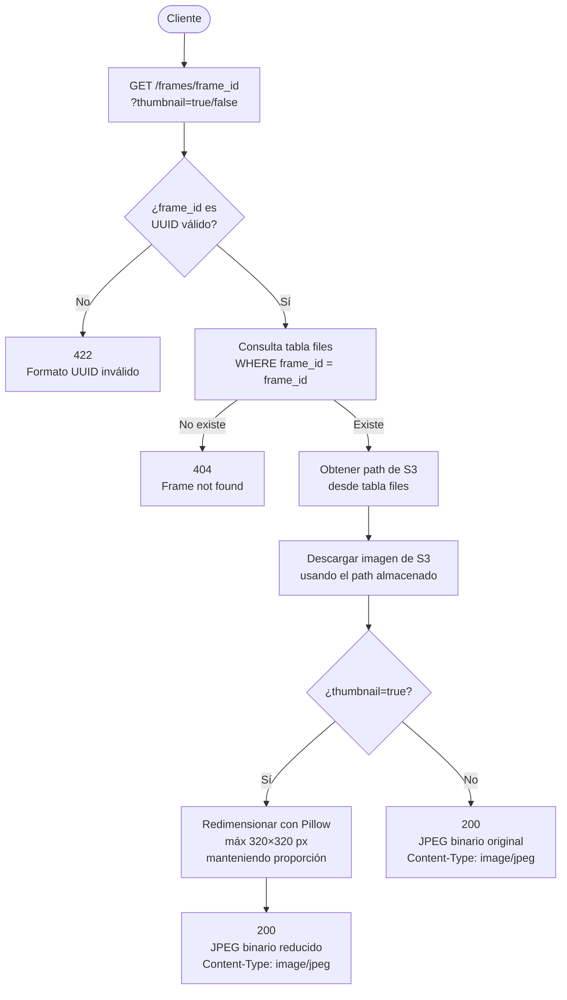
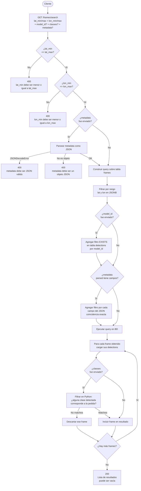
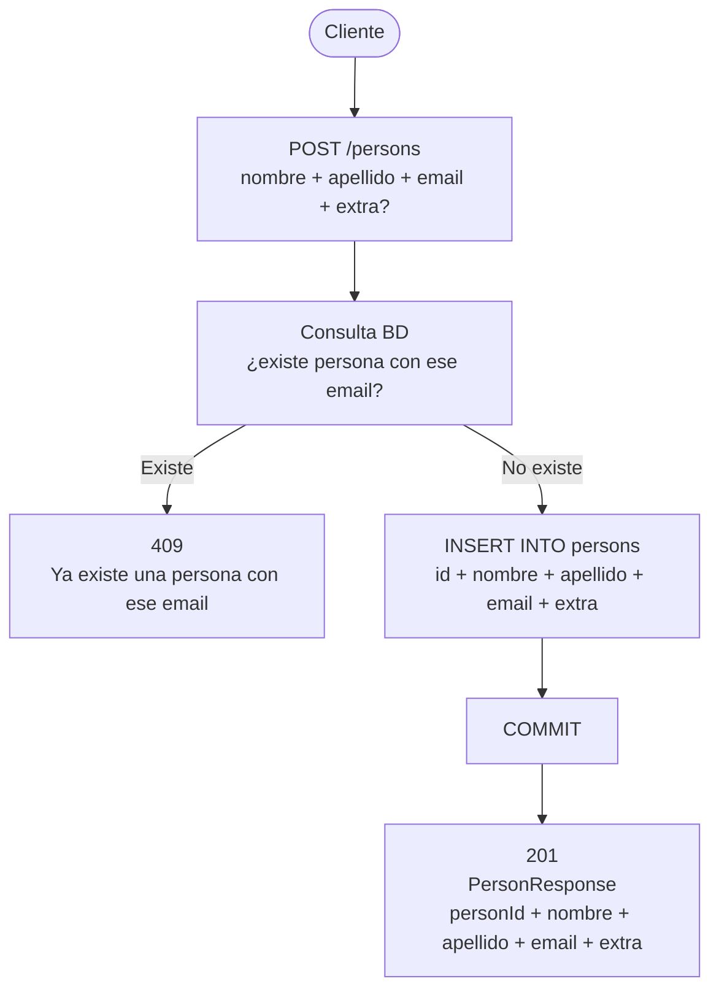
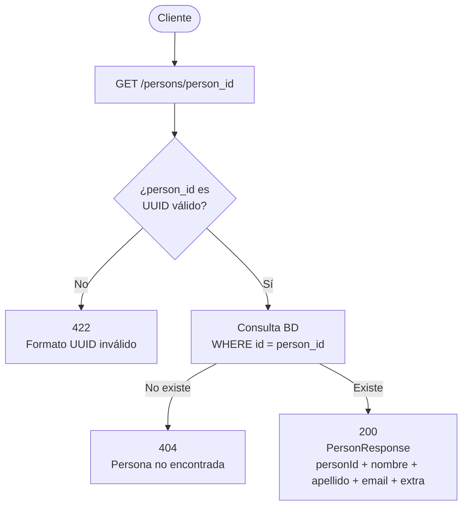
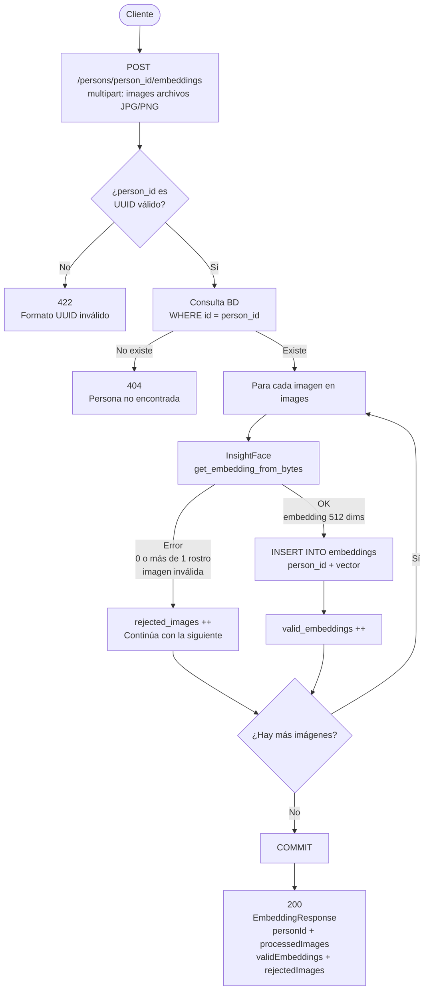
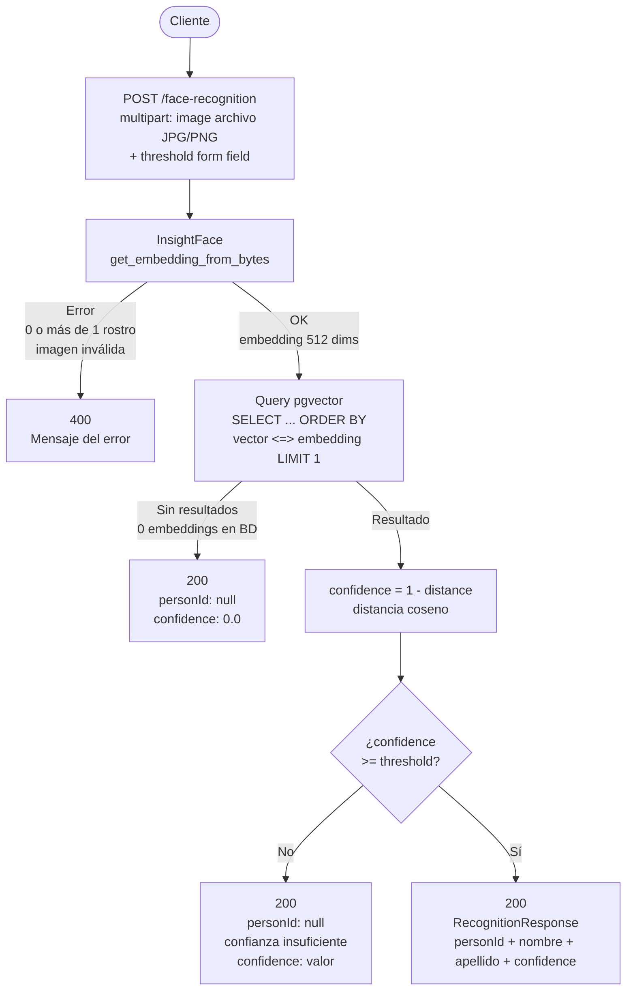

# Diagramas de flujo — Endpoints

---

## GET /health

---

## S1 — GET /models

---

## S2 — POST /detections

---

## S3 — GET /frames/{frameId}

---

## S4 — GET /frames/search

---

## S5.1 — POST /persons

---

## S5.2 — GET /persons/{person_id}

---

## S5.3 — POST /persons/{person_id}/embeddings

---

## S5.4 — POST /face-recognition

---

