# Diagramas de flujo — Endpoints

---

## GET /health

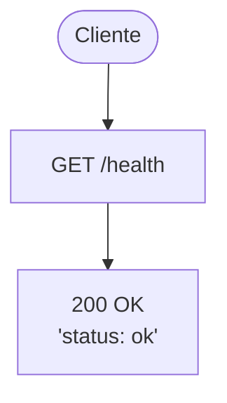
```mermaid
flowchart TD
    A([Cliente]) --> B[GET /health]
    B --> C[200 OK\n'status: ok']
```

---

## S1 — GET /models

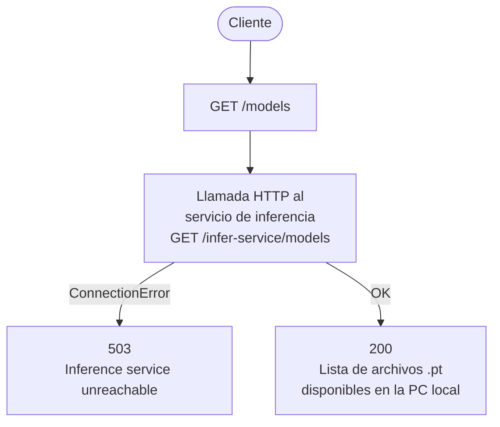
```mermaid
flowchart TD
    A([Cliente]) --> B[GET /models]
    B --> C[Llamada HTTP al\nservicio de inferencia\nGET /infer-service/models]
    C -- ConnectionError --> D[503\nInference service unreachable]
    C -- OK --> E[200\nLista de archivos .pt\ndisponibles en la PC local]
```

---

## S2 — POST /detections

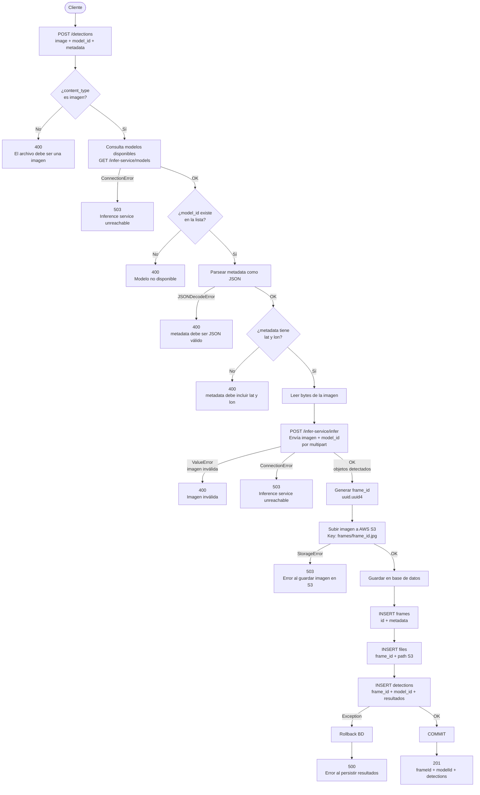
```mermaid
flowchart TD
    A([Cliente]) --> B[POST /detections\nimage + model_id + metadata]

    B --> C{¿content_type\nes imagen?}
    C -- No --> E1[400\nEl archivo debe ser una imagen]

    C -- Sí --> D[Consulta modelos disponibles\nGET /infer-service/models]
    D -- ConnectionError --> E2[503\nInference service unreachable]

    D -- OK --> F{¿model_id existe\nen la lista?}
    F -- No --> E3[400\nModelo no disponible]

    F -- Sí --> G[Parsear metadata como JSON]
    G -- JSONDecodeError --> E4[400\nmetadata debe ser JSON válido]

    G -- OK --> H{¿metadata tiene\nlat y lon?}
    H -- No --> E5[400\nmetadata debe incluir lat y lon]

    H -- Sí --> I[Leer bytes de la imagen]
    I --> J[POST /infer-service/infer\nEnvía imagen + model_id\npor multipart]

    J -- ValueError\nimagen inválida --> E6[400\nImagen inválida]
    J -- ConnectionError --> E7[503\nInference service unreachable]

    J -- OK\nobjetos detectados --> K[Generar frame_id\nuuid.uuid4]

    K --> L[Subir imagen a AWS S3\nKey: frames/frame_id.jpg]
    L -- StorageError --> E8[503\nError al guardar imagen en S3]

    L -- OK --> M[Guardar en base de datos]
    M --> M1[INSERT frames\nid + metadata]
    M1 --> M2[INSERT files\nframe_id + path S3]
    M2 --> M3[INSERT detections\nframe_id + model_id + resultados]

    M3 -- Exception --> N[Rollback BD]
    N --> E9[500\nError al persistir resultados]

    M3 -- OK --> O[COMMIT]
    O --> P[201\nframeId + modelId + detections]
```

---

## S3 — GET /frames/{frameId}

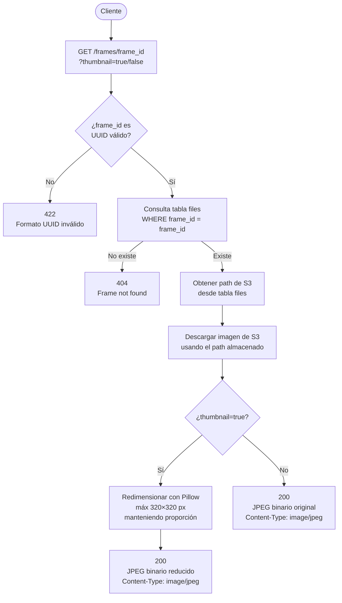
```mermaid
flowchart TD
    A([Cliente]) --> B[GET /frames/frame_id\n?thumbnail=true/false]

    B --> C{¿frame_id es\nUUID válido?}
    C -- No --> E1[422\nFormato UUID inválido]

    C -- Sí --> D[Consulta tabla files\nWHERE frame_id = frame_id]

    D -- No existe --> E2[404\nFrame not found]

    D -- Existe --> E[Obtener path de S3\ndesde tabla files]

    E --> F[Descargar imagen de S3\nusando el path almacenado]

    F --> G{¿thumbnail=true?}

    G -- Sí --> H[Redimensionar con Pillow\nmáx 320×320 px\nmanteniendo proporción]
    H --> I[200\nJPEG binario reducido\nContent-Type: image/jpeg]

    G -- No --> J[200\nJPEG binario original\nContent-Type: image/jpeg]
```

---

## S4 — GET /frames/search

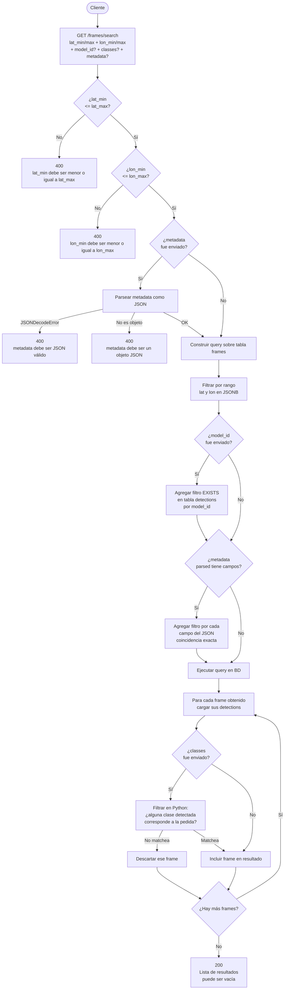
```mermaid
flowchart TD
    A([Cliente]) --> B[GET /frames/search\nlat_min/max + lon_min/max\n+ model_id? + classes? + metadata?]

    B --> C{¿lat_min\n<= lat_max?}
    C -- No --> E1[400\nlat_min debe ser menor o igual a lat_max]

    C -- Sí --> D{¿lon_min\n<= lon_max?}
    D -- No --> E2[400\nlon_min debe ser menor o igual a lon_max]

    D -- Sí --> F{¿metadata\nfue enviado?}

    F -- Sí --> G[Parsear metadata como JSON]
    G -- JSONDecodeError --> E3[400\nmetadata debe ser JSON válido]
    G -- No es objeto --> E4[400\nmetadata debe ser un objeto JSON]
    G -- OK --> H

    F -- No --> H[Construir query sobre tabla frames]

    H --> H1[Filtrar por rango\nlat y lon en JSONB]

    H1 --> I{¿model_id\nfue enviado?}
    I -- Sí --> I1[Agregar filtro EXISTS\nen tabla detections\npor model_id]
    I1 --> J
    I -- No --> J

    J{¿metadata\nparsed tiene campos?}
    J -- Sí --> J1[Agregar filtro por cada\ncampo del JSON\ncoincidencia exacta]
    J1 --> K
    J -- No --> K

    K[Ejecutar query en BD]
    K --> L[Para cada frame obtenido\ncargar sus detections]

    L --> M{¿classes\nfue enviado?}

    M -- Sí --> N[Filtrar en Python:\n¿alguna clase detectada\ncorresponde a la pedida?]
    N -- No matchea --> O[Descartar ese frame]
    N -- Matchea --> P

    M -- No --> P[Incluir frame en resultado]

    O --> Q{¿Hay más frames?}
    P --> Q

    Q -- Sí --> L
    Q -- No --> R[200\nLista de resultados\npuede ser vacía]
```

---

## S5.1 — POST /persons

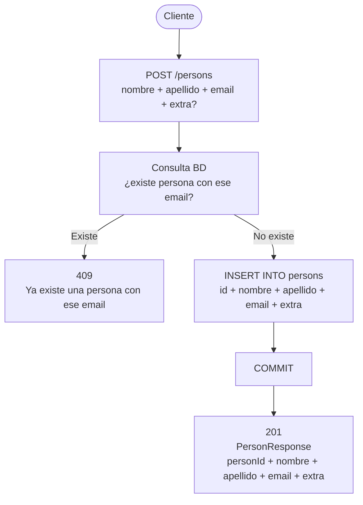
```mermaid
flowchart TD
    A([Cliente]) --> B[POST /persons\nnombre + apellido + email + extra?]

    B --> C[Consulta BD\n¿existe persona con ese email?]
    C -- Existe --> E1[409\nYa existe una persona con ese email]

    C -- No existe --> D[INSERT INTO persons\nid + nombre + apellido + email + extra]
    D --> E[COMMIT]
    E --> F[201\nPersonResponse\npersonId + nombre + apellido + email + extra]
```

---

## S5.2 — GET /persons/{person_id}

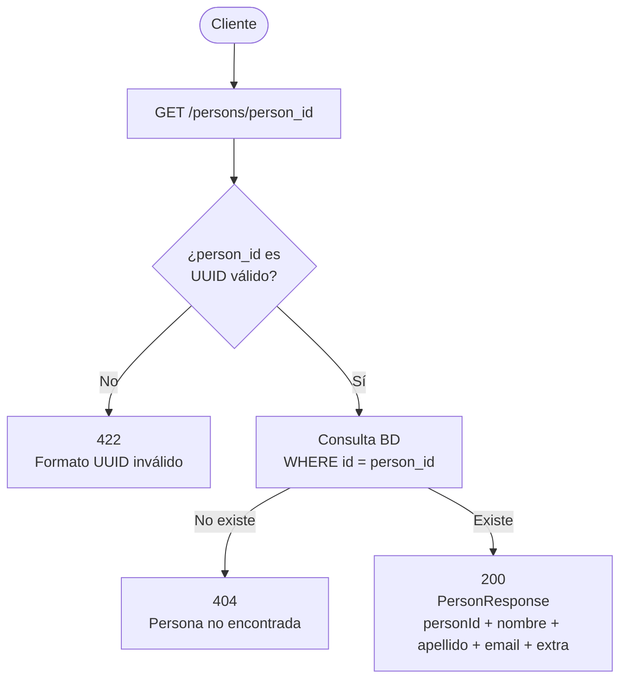
```mermaid
flowchart TD
    A([Cliente]) --> B[GET /persons/person_id]

    B --> C{¿person_id es\nUUID válido?}
    C -- No --> E1[422\nFormato UUID inválido]

    C -- Sí --> D[Consulta BD\nWHERE id = person_id]
    D -- No existe --> E2[404\nPersona no encontrada]
    D -- Existe --> E[200\nPersonResponse\npersonId + nombre + apellido + email + extra]
```

---

## S5.3 — POST /persons/{person_id}/embeddings

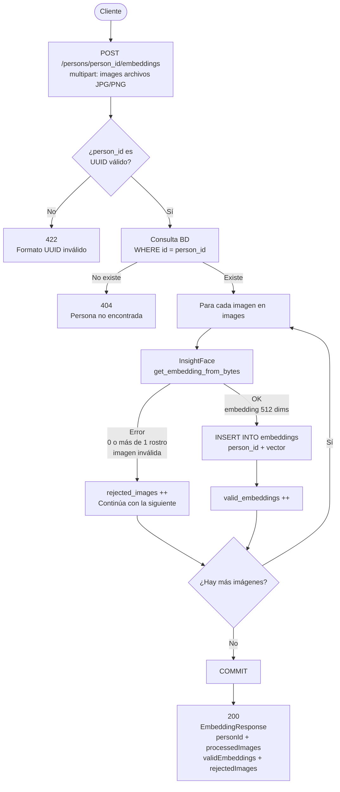
```mermaid
flowchart TD
    A([Cliente]) --> B[POST /persons/person_id/embeddings\nmultipart: images archivos JPG/PNG]

    B --> C{¿person_id es\nUUID válido?}
    C -- No --> E1[422\nFormato UUID inválido]

    C -- Sí --> D[Consulta BD\nWHERE id = person_id]
    D -- No existe --> E2[404\nPersona no encontrada]

    D -- Existe --> E[Para cada imagen en images]

    E --> F[InsightFace\nget_embedding_from_bytes]
    F -- Error\n0 o más de 1 rostro\nimagen inválida --> G[rejected_images ++\nContinúa con la siguiente]
    F -- OK\nembedding 512 dims --> H[INSERT INTO embeddings\nperson_id + vector]
    H --> I[valid_embeddings ++]

    G --> J{¿Hay más imágenes?}
    I --> J
    J -- Sí --> E
    J -- No --> K[COMMIT]
    K --> L[200\nEmbeddingResponse\npersonId + processedImages\nvalidEmbeddings + rejectedImages]
```

---

## S5.4 — POST /face-recognition

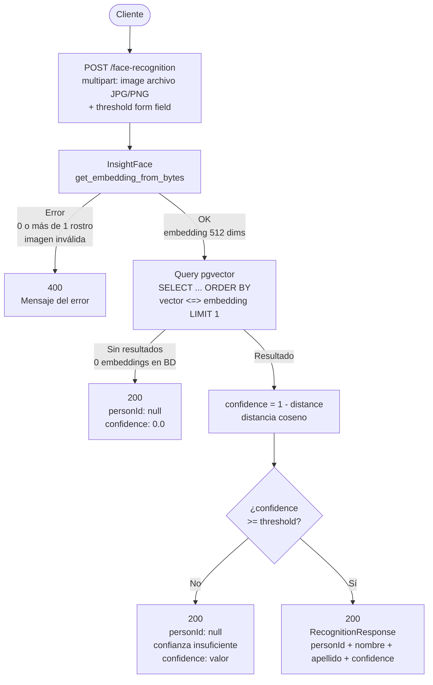
```mermaid
flowchart TD
    A([Cliente]) --> B[POST /face-recognition\nmultipart: image archivo JPG/PNG\n+ threshold form field]

    B --> C[InsightFace\nget_embedding_from_bytes]
    C -- Error\n0 o más de 1 rostro\nimagen inválida --> E1[400\nMensaje del error]

    C -- OK\nembedding 512 dims --> D[Query pgvector\nSELECT ... ORDER BY\nvector <=> embedding LIMIT 1]
    D -- Sin resultados\n0 embeddings en BD --> E2[200\npersonId: null\nconfidence: 0.0]

    D -- Resultado --> F[confidence = 1 - distance\ndistancia coseno]

    F --> G{¿confidence\n>= threshold?}
    G -- No --> E3[200\npersonId: null\nconfianza insuficiente\nconfidence: valor]
    G -- Sí --> H[200\nRecognitionResponse\npersonId + nombre + apellido + confidence]
```

---

## Auth.1 — POST /auth/register

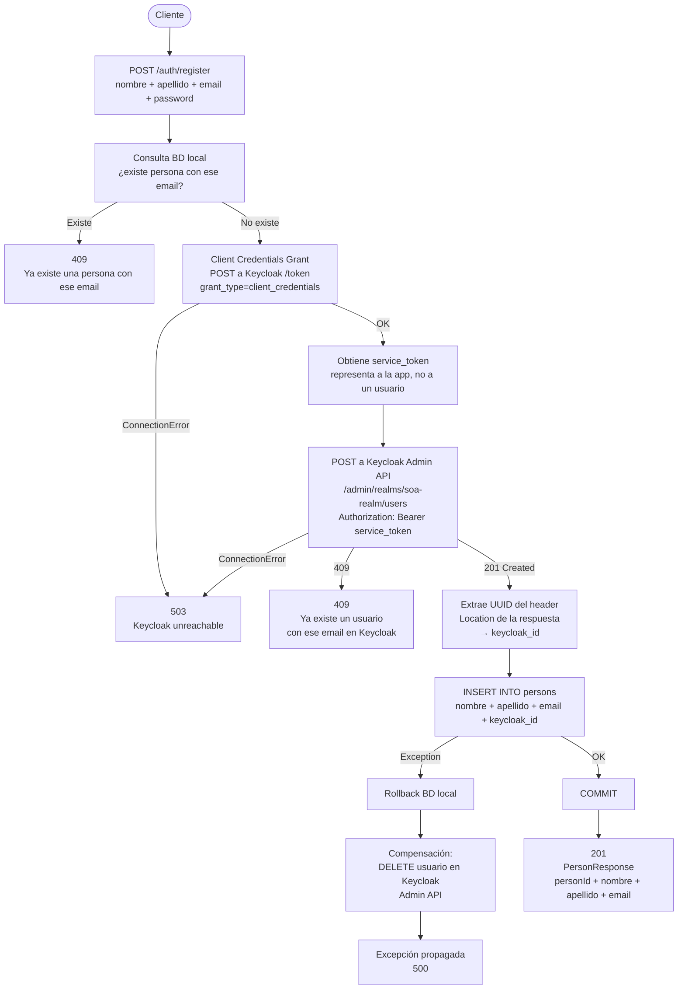
```mermaid
flowchart TD
    A([Cliente]) --> B[POST /auth/register\nnombre + apellido + email + password]

    B --> C[Consulta BD local\n¿existe persona con ese email?]
    C -- Existe --> E1[409\nYa existe una persona con ese email]

    C -- No existe --> D[Client Credentials Grant\nPOST a Keycloak /token\ngrant_type=client_credentials]
    D -- ConnectionError --> E2[503\nKeycloak unreachable]

    D -- OK --> F[Obtiene service_token\nrepresenta a la app, no a un usuario]

    F --> G[POST a Keycloak Admin API\n/admin/realms/soa-realm/users\nAuthorization: Bearer service_token]
    G -- ConnectionError --> E2
    G -- 409 --> E3[409\nYa existe un usuario\ncon ese email en Keycloak]

    G -- 201 Created --> H[Extrae UUID del header\nLocation de la respuesta\n→ keycloak_id]

    H --> I[INSERT INTO persons\nnombre + apellido + email + keycloak_id]

    I -- Exception --> J[Rollback BD local]
    J --> K[Compensación:\nDELETE usuario en Keycloak\nAdmin API]
    K --> E4[Excepción propagada\n500]

    I -- OK --> L[COMMIT]
    L --> M[201\nPersonResponse\npersonId + nombre + apellido + email]
```

---

## Auth.2 — POST /auth/login

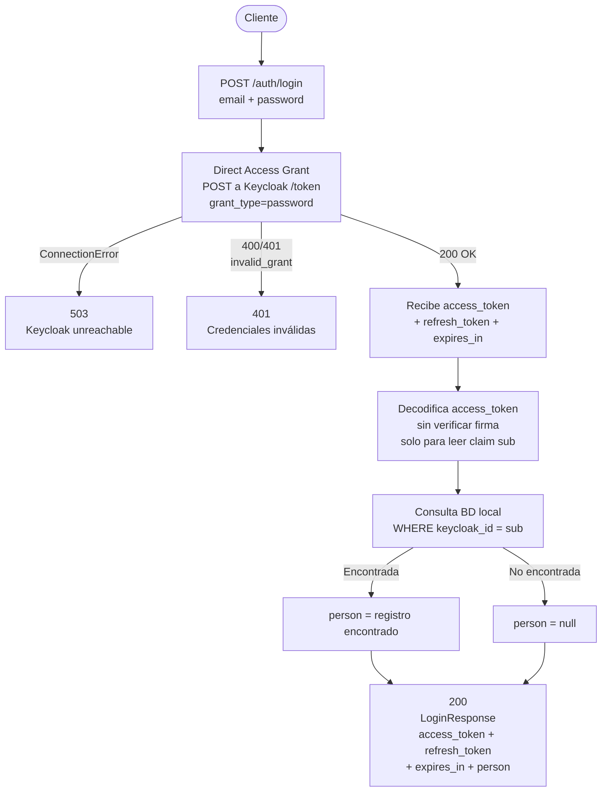
```mermaid
flowchart TD
    A([Cliente]) --> B[POST /auth/login\nemail + password]

    B --> C[Direct Access Grant\nPOST a Keycloak /token\ngrant_type=password]

    C -- ConnectionError --> E1[503\nKeycloak unreachable]
    C -- 400/401\ninvalid_grant --> E2[401\nCredenciales inválidas]

    C -- 200 OK --> D[Recibe access_token\n+ refresh_token + expires_in]

    D --> E[Decodifica access_token\nsin verificar firma\nsolo para leer claim sub]

    E --> F[Consulta BD local\nWHERE keycloak_id = sub]
    F -- Encontrada --> G1[person = registro encontrado]
    F -- No encontrada --> G2[person = null]

    G1 --> H[200\nLoginResponse\naccess_token + refresh_token\n+ expires_in + person]
    G2 --> H
```

---

## Auth.3 — POST /auth/refresh

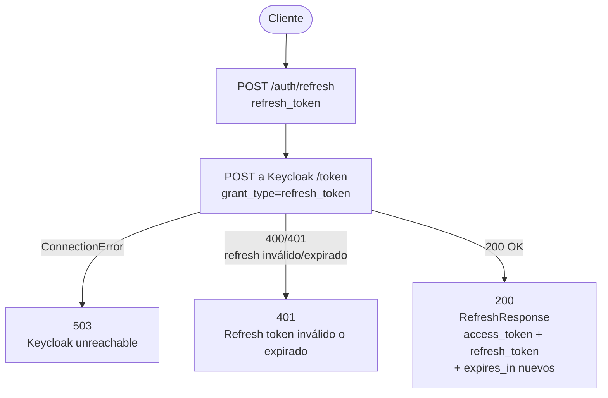
```mermaid
flowchart TD
    A([Cliente]) --> B[POST /auth/refresh\nrefresh_token]

    B --> C[POST a Keycloak /token\ngrant_type=refresh_token]

    C -- ConnectionError --> E1[503\nKeycloak unreachable]
    C -- 400/401\nrefresh inválido/expirado --> E2[401\nRefresh token inválido o expirado]

    C -- 200 OK --> D[200\nRefreshResponse\naccess_token + refresh_token\n+ expires_in nuevos]
```

---

## Validación de JWT en un endpoint protegido (aplica a S1, S2, S3, S4 y S5)

Este flujo se ejecuta **antes** de cualquiera de los diagramas de S1 a S5 — es la dependency `get_current_user`, activada vía `dependencies=[Depends(...)]` a nivel de cada router. Solo si pasa entero, la request continúa con el flujo específico del endpoint.

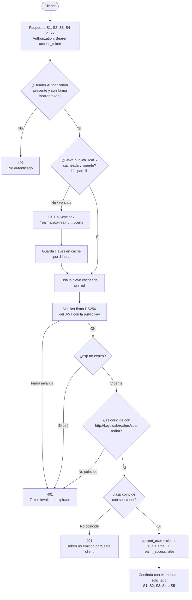
```mermaid
flowchart TD
    A([Cliente]) --> B[Request a S1, S2, S3, S4 o S5\nAuthorization: Bearer access_token]

    B --> C{¿Header Authorization\npresente y con forma\nBearer token?}
    C -- No --> E1[401\nNo autenticado]

    C -- Sí --> D{¿Clave pública JWKS\ncacheada y vigente?\nlifespan 1h}

    D -- No / vencida --> D1[GET a Keycloak\n/realms/soa-realm/...../certs]
    D1 --> D2[Guarda claves en caché\npor 1 hora]
    D2 --> F

    D -- Sí --> F[Usa la clave cacheada\nsin red]

    F --> G[Verifica firma RS256\ndel JWT con la public key]
    G -- Firma inválida --> E2[401\nToken inválido o expirado]

    G -- OK --> H{¿exp no expiró?}
    H -- Expiró --> E2

    H -- Vigente --> I{¿iss coincide con\nhttp://keycloak/realms/soa-realm?}
    I -- No coincide --> E2

    I -- Sí --> J{¿azp coincide\ncon soa-client?}
    J -- No coincide --> E3[401\nToken no emitido para este client]

    J -- Sí --> K[current_user = claims\nsub + email + realm_access.roles]

    K --> L[Continúa con el endpoint solicitado\nS1, S2, S3, S4 o S5]
```

---

