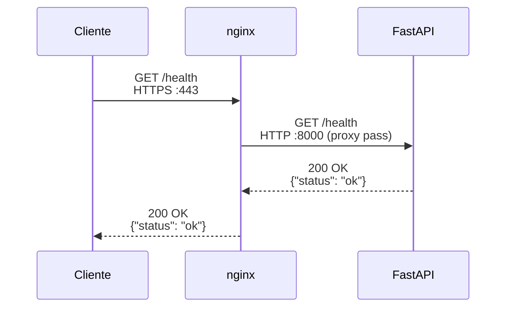
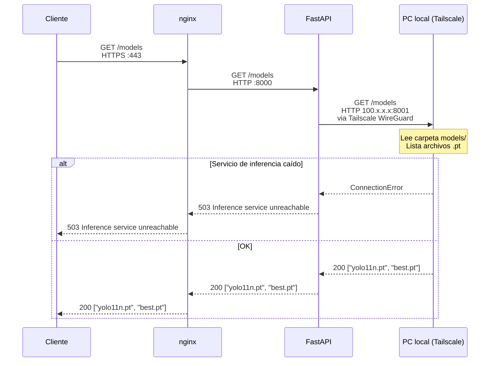
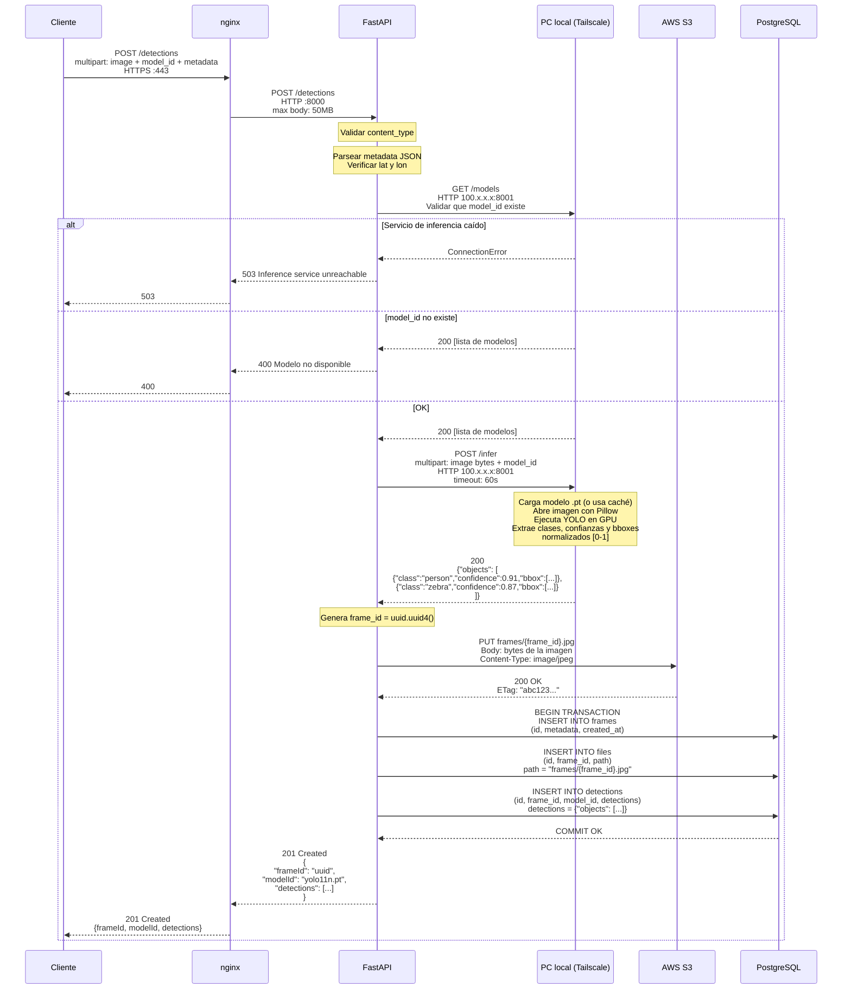
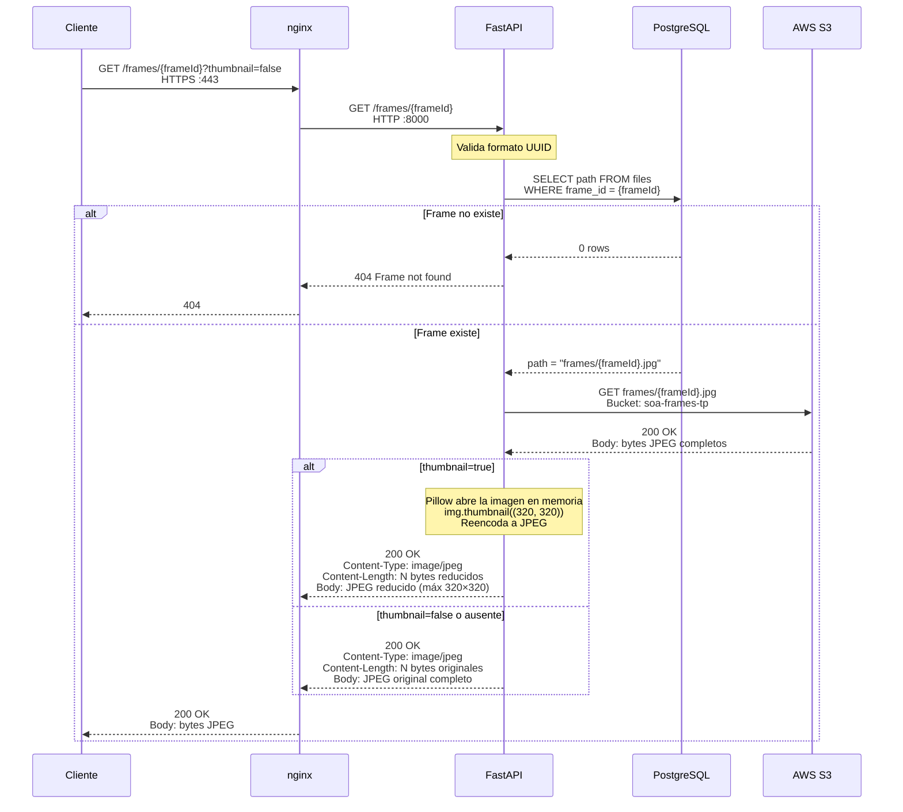
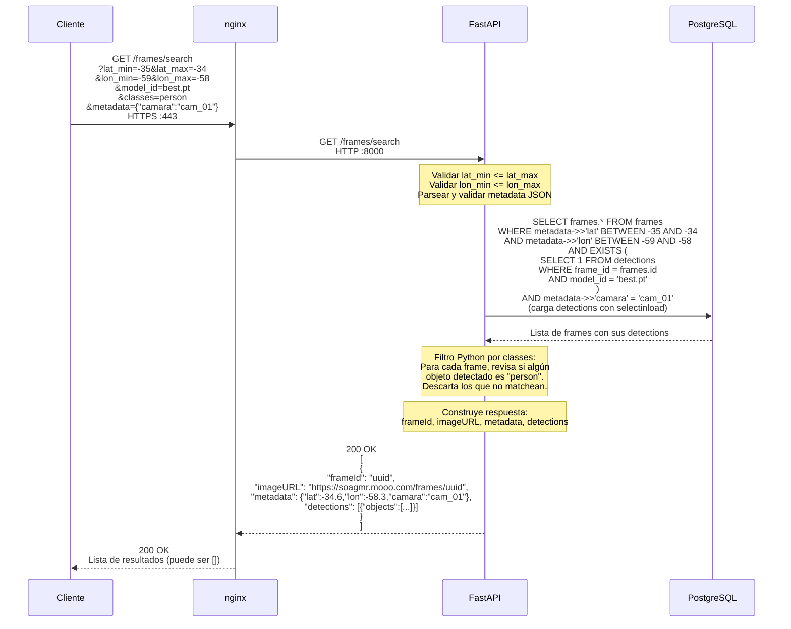

# Diagramas de secuencia — Flujo de datos entre servicios

Muestra exactamente cómo viajan los datos entre cada componente del sistema para cada endpoint.

**Componentes:**
- **Cliente** — Postman, curl, cualquier HTTP client
- **nginx** — reverse proxy en el VPS, puerto 80/443
- **FastAPI** — aplicación Python, contenedor Docker en el VPS, puerto 8000 interno
- **PostgreSQL** — base de datos, contenedor Docker en el VPS, puerto 5432 interno
- **AWS S3** — almacenamiento de objetos, internet
- **PC local** — servicio de inferencia YOLO, conectado vía Tailscale, puerto 8001

---

## GET /health

---

## S1 — GET /models

---

## S2 — POST /detections

---

## S3 — GET /frames/{frameId}

---

## S4 — GET /frames/search

---

