# Diagramas de secuencia — Flujo de datos entre servicios

Muestra exactamente cómo viajan los datos entre cada componente del sistema para cada endpoint.

**Componentes:**
- **Cliente** — Postman, curl, cualquier HTTP client
- **nginx** — reverse proxy en el VPS, puerto 80/443
- **FastAPI** — aplicación Python, contenedor Docker en el VPS, puerto 8000 interno
- **PostgreSQL** — base de datos, contenedor Docker en el VPS, puerto 5432 interno
- **AWS S3** — almacenamiento de objetos, internet
- **PC local** — servicio de inferencia YOLO, conectado vía Tailscale, puerto 8001
- **Keycloak** — servidor de identidad (IAM), contenedor Docker en el VPS, puerto 8080 interno. Tiene su propia base de datos (`keycloak_db`), no se muestra por separado en estos diagramas — se trata como una caja única, igual que "PC local" para el servicio de inferencia.

---

## GET /health

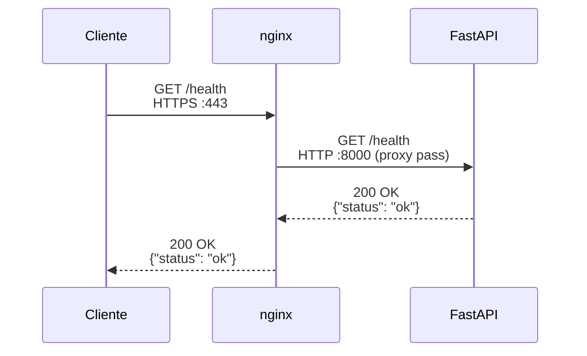
```mermaid
sequenceDiagram
    participant C as Cliente
    participant N as nginx
    participant F as FastAPI

    C->>N: GET /health<br/>HTTPS :443
    N->>F: GET /health<br/>HTTP :8000 (proxy pass)
    F-->>N: 200 OK<br/>{"status": "ok"}
    N-->>C: 200 OK<br/>{"status": "ok"}
```

---

## S1 — GET /models

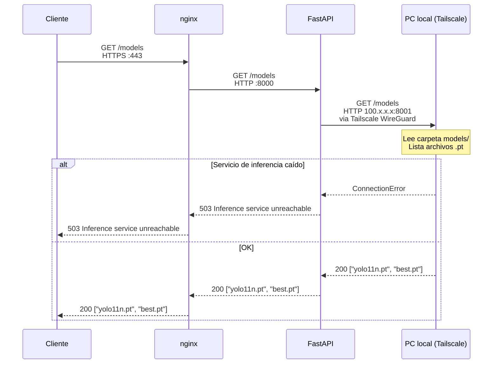
```mermaid
sequenceDiagram
    participant C as Cliente
    participant N as nginx
    participant F as FastAPI
    participant PC as PC local (Tailscale)

    C->>N: GET /models<br/>HTTPS :443
    N->>F: GET /models<br/>HTTP :8000

    F->>PC: GET /models<br/>HTTP 100.x.x.x:8001<br/>via Tailscale WireGuard
    Note over PC: Lee carpeta models/<br/>Lista archivos .pt

    alt Servicio de inferencia caído
        PC-->>F: ConnectionError
        F-->>N: 503 Inference service unreachable
        N-->>C: 503 Inference service unreachable
    else OK
        PC-->>F: 200 ["yolo11n.pt", "best.pt"]
        F-->>N: 200 ["yolo11n.pt", "best.pt"]
        N-->>C: 200 ["yolo11n.pt", "best.pt"]
    end
```

---

## S2 — POST /detections

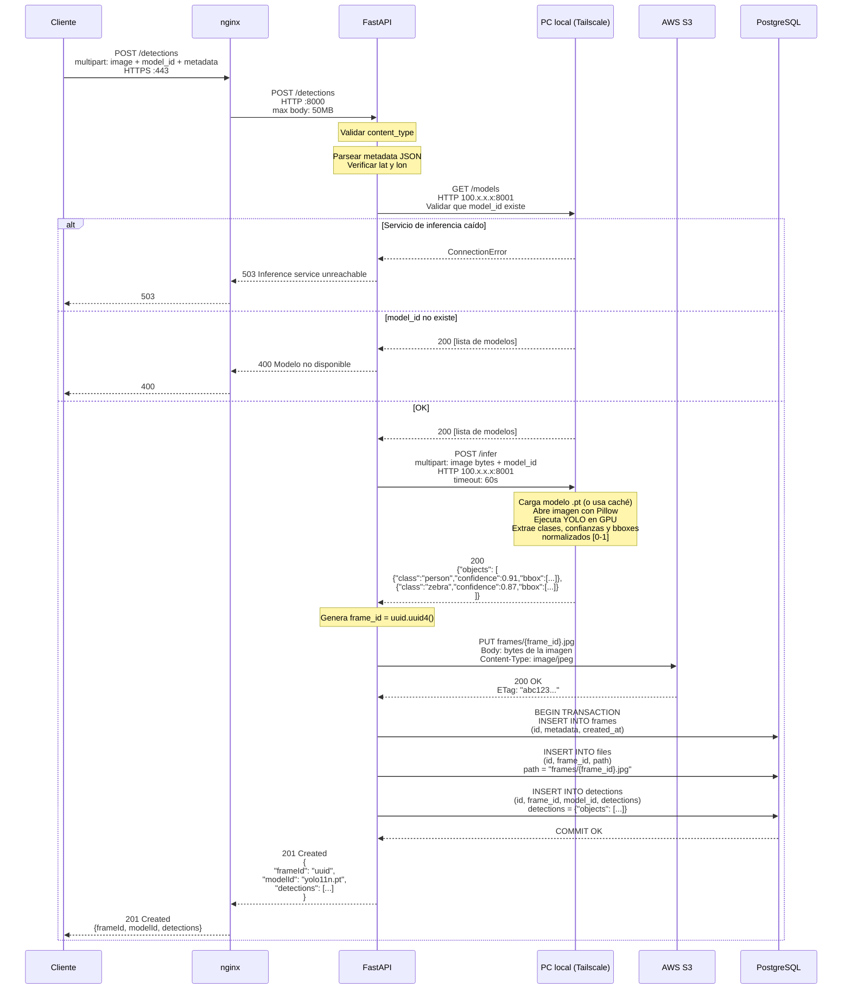
```mermaid
sequenceDiagram
    participant C as Cliente
    participant N as nginx
    participant F as FastAPI
    participant PC as PC local (Tailscale)
    participant S3 as AWS S3
    participant DB as PostgreSQL

    C->>N: POST /detections<br/>multipart: image + model_id + metadata<br/>HTTPS :443
    N->>F: POST /detections<br/>HTTP :8000<br/>max body: 50MB

    Note over F: Validar content_type
    Note over F: Parsear metadata JSON<br/>Verificar lat y lon

    F->>PC: GET /models<br/>HTTP 100.x.x.x:8001<br/>Validar que model_id existe

    alt Servicio de inferencia caído
        PC-->>F: ConnectionError
        F-->>N: 503 Inference service unreachable
        N-->>C: 503
    else model_id no existe
        PC-->>F: 200 [lista de modelos]
        F-->>N: 400 Modelo no disponible
        N-->>C: 400
    else OK
        PC-->>F: 200 [lista de modelos]

        F->>PC: POST /infer<br/>multipart: image bytes + model_id<br/>HTTP 100.x.x.x:8001<br/>timeout: 60s

        Note over PC: Carga modelo .pt (o usa caché)<br/>Abre imagen con Pillow<br/>Ejecuta YOLO en GPU<br/>Extrae clases, confianzas y bboxes<br/>normalizados [0-1]

        PC-->>F: 200<br/>{"objects": [<br/>  {"class":"person","confidence":0.91,"bbox":[...]},<br/>  {"class":"zebra","confidence":0.87,"bbox":[...]}<br/>]}

        Note over F: Genera frame_id = uuid.uuid4()

        F->>S3: PUT frames/{frame_id}.jpg<br/>Body: bytes de la imagen<br/>Content-Type: image/jpeg
        S3-->>F: 200 OK<br/>ETag: "abc123..."

        F->>DB: BEGIN TRANSACTION<br/>INSERT INTO frames<br/>(id, metadata, created_at)
        F->>DB: INSERT INTO files<br/>(id, frame_id, path)<br/>path = "frames/{frame_id}.jpg"
        F->>DB: INSERT INTO detections<br/>(id, frame_id, model_id, detections)<br/>detections = {"objects": [...]}
        DB-->>F: COMMIT OK

        F-->>N: 201 Created<br/>{<br/>  "frameId": "uuid",<br/>  "modelId": "yolo11n.pt",<br/>  "detections": [...]<br/>}
        N-->>C: 201 Created<br/>{frameId, modelId, detections}
    end
```

---

## S3 — GET /frames/{frameId}

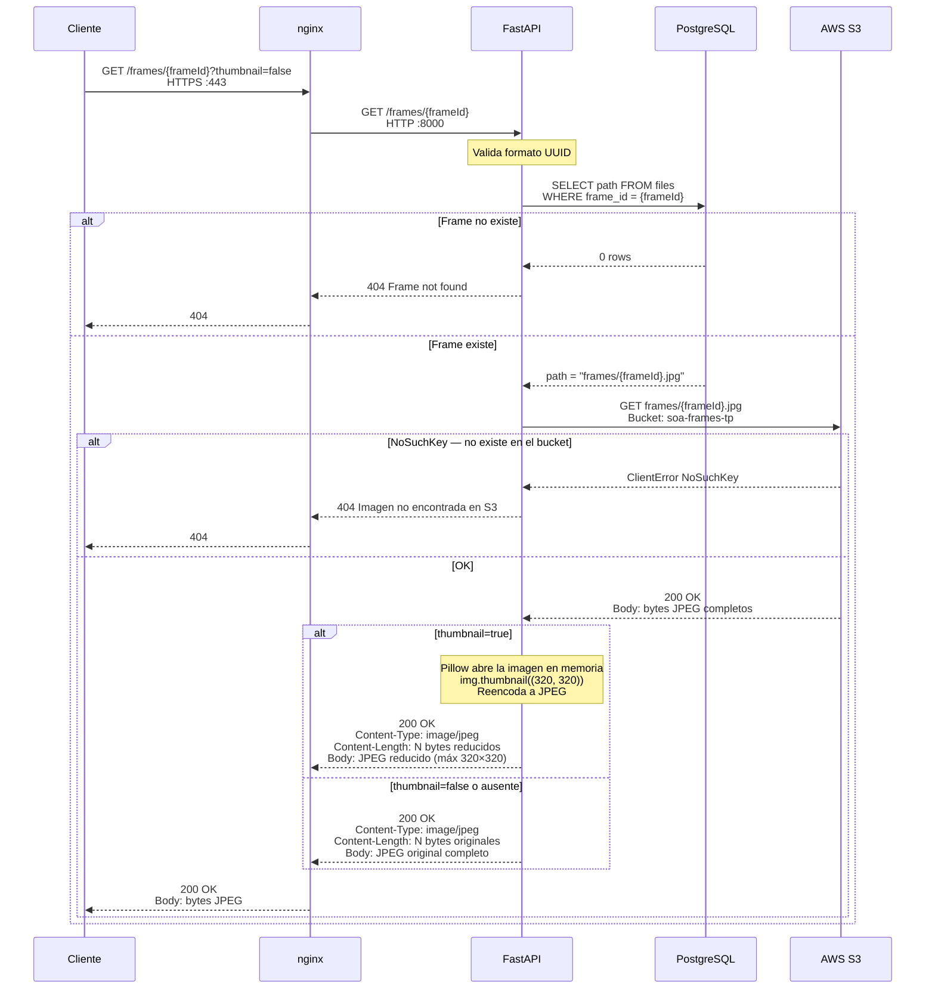
```mermaid
sequenceDiagram
    participant C as Cliente
    participant N as nginx
    participant F as FastAPI
    participant DB as PostgreSQL
    participant S3 as AWS S3

    C->>N: GET /frames/{frameId}?thumbnail=false<br/>HTTPS :443
    N->>F: GET /frames/{frameId}<br/>HTTP :8000

    Note over F: Valida formato UUID

    F->>DB: SELECT path FROM files<br/>WHERE frame_id = {frameId}

    alt Frame no existe
        DB-->>F: 0 rows
        F-->>N: 404 Frame not found
        N-->>C: 404
    else Frame existe
        DB-->>F: path = "frames/{frameId}.jpg"

        F->>S3: GET frames/{frameId}.jpg<br/>Bucket: soa-frames-tp

        alt NoSuchKey — no existe en el bucket
            S3-->>F: ClientError NoSuchKey
            F-->>N: 404 Imagen no encontrada en S3
            N-->>C: 404
        else OK
            S3-->>F: 200 OK<br/>Body: bytes JPEG completos

            alt thumbnail=true
                Note over F: Pillow abre la imagen en memoria<br/>img.thumbnail((320, 320))<br/>Reencoda a JPEG
                F-->>N: 200 OK<br/>Content-Type: image/jpeg<br/>Content-Length: N bytes reducidos<br/>Body: JPEG reducido (máx 320×320)
            else thumbnail=false o ausente
                F-->>N: 200 OK<br/>Content-Type: image/jpeg<br/>Content-Length: N bytes originales<br/>Body: JPEG original completo
            end

            N-->>C: 200 OK<br/>Body: bytes JPEG
        end
    end
```

---

## S4 — GET /frames/search

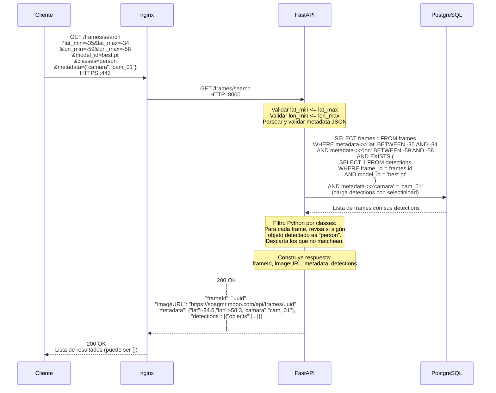
```mermaid
sequenceDiagram
    participant C as Cliente
    participant N as nginx
    participant F as FastAPI
    participant DB as PostgreSQL

    C->>N: GET /frames/search<br/>?lat_min=-35&lat_max=-34<br/>&lon_min=-59&lon_max=-58<br/>&model_id=best.pt<br/>&classes=person<br/>&metadata={"camara":"cam_01"}<br/>HTTPS :443

    N->>F: GET /frames/search<br/>HTTP :8000

    Note over F: Validar lat_min <= lat_max<br/>Validar lon_min <= lon_max<br/>Parsear y validar metadata JSON

    F->>DB: SELECT frames.* FROM frames<br/>WHERE metadata->>'lat' BETWEEN -35 AND -34<br/>AND metadata->>'lon' BETWEEN -59 AND -58<br/>AND EXISTS (<br/>  SELECT 1 FROM detections<br/>  WHERE frame_id = frames.id<br/>  AND model_id = 'best.pt'<br/>)<br/>AND metadata->>'camara' = 'cam_01'<br/>(carga detections con selectinload)

    DB-->>F: Lista de frames con sus detections

    Note over F: Filtro Python por classes:<br/>Para cada frame, revisa si algún<br/>objeto detectado es "person".<br/>Descarta los que no matchean.

    Note over F: Construye respuesta:<br/>frameId, imageURL, metadata, detections

    F-->>N: 200 OK<br/>[<br/>  {<br/>    "frameId": "uuid",<br/>    "imageURL": "https://soagmr.mooo.com/api/frames/uuid",<br/>    "metadata": {"lat":-34.6,"lon":-58.3,"camara":"cam_01"},<br/>    "detections": [{"objects":[...]}]<br/>  }<br/>]
    N-->>C: 200 OK<br/>Lista de resultados (puede ser [])
```

---

## S5.1 — POST /persons

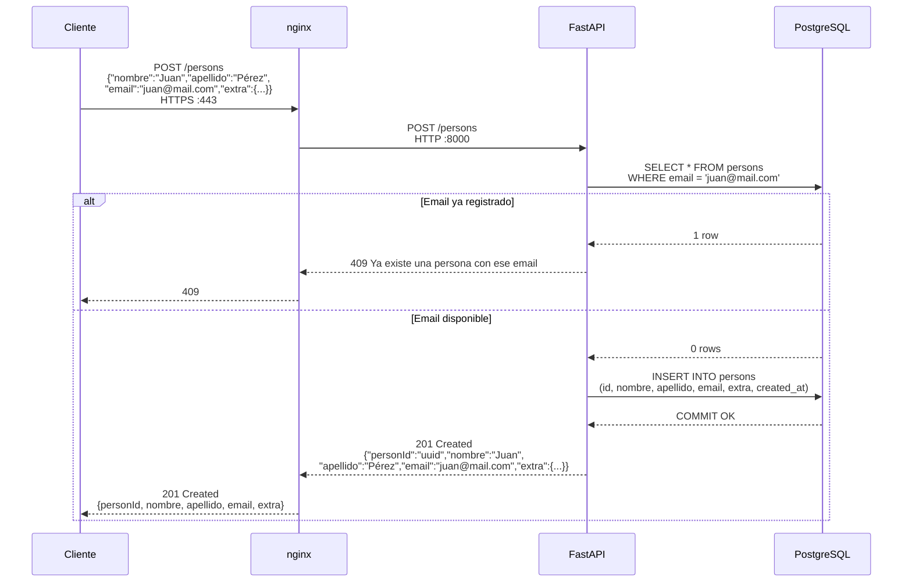
```mermaid
sequenceDiagram
    participant C as Cliente
    participant N as nginx
    participant F as FastAPI
    participant DB as PostgreSQL

    C->>N: POST /persons<br/>{"nombre":"Juan","apellido":"Pérez",<br/>"email":"juan@mail.com","extra":{...}}<br/>HTTPS :443
    N->>F: POST /persons<br/>HTTP :8000

    F->>DB: SELECT * FROM persons<br/>WHERE email = 'juan@mail.com'

    alt Email ya registrado
        DB-->>F: 1 row
        F-->>N: 409 Ya existe una persona con ese email
        N-->>C: 409
    else Email disponible
        DB-->>F: 0 rows
        F->>DB: INSERT INTO persons<br/>(id, nombre, apellido, email, extra, created_at)
        DB-->>F: COMMIT OK
        F-->>N: 201 Created<br/>{"personId":"uuid","nombre":"Juan",<br/>"apellido":"Pérez","email":"juan@mail.com","extra":{...}}
        N-->>C: 201 Created<br/>{personId, nombre, apellido, email, extra}
    end
```

---

## S5.2 — GET /persons/{person_id}

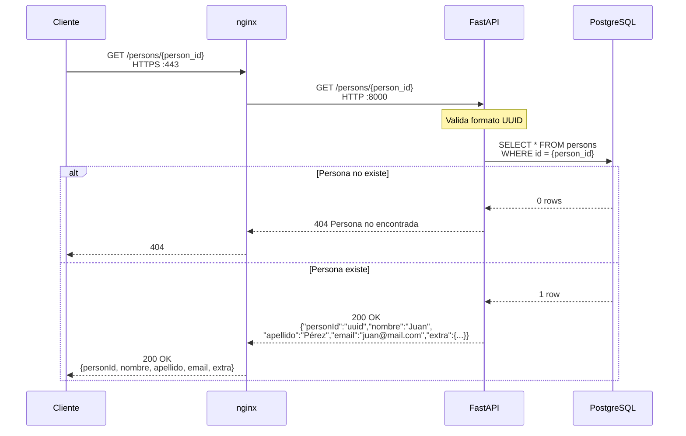
```mermaid
sequenceDiagram
    participant C as Cliente
    participant N as nginx
    participant F as FastAPI
    participant DB as PostgreSQL

    C->>N: GET /persons/{person_id}<br/>HTTPS :443
    N->>F: GET /persons/{person_id}<br/>HTTP :8000

    Note over F: Valida formato UUID

    F->>DB: SELECT * FROM persons<br/>WHERE id = {person_id}

    alt Persona no existe
        DB-->>F: 0 rows
        F-->>N: 404 Persona no encontrada
        N-->>C: 404
    else Persona existe
        DB-->>F: 1 row
        F-->>N: 200 OK<br/>{"personId":"uuid","nombre":"Juan",<br/>"apellido":"Pérez","email":"juan@mail.com","extra":{...}}
        N-->>C: 200 OK<br/>{personId, nombre, apellido, email, extra}
    end
```

---

## S5.3 — POST /persons/{person_id}/embeddings

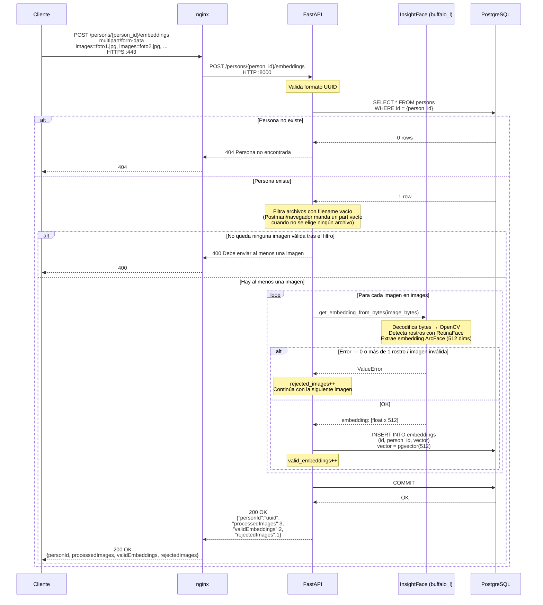
```mermaid
sequenceDiagram
    participant C as Cliente
    participant N as nginx
    participant F as FastAPI
    participant IF as InsightFace (buffalo_l)
    participant DB as PostgreSQL

    C->>N: POST /persons/{person_id}/embeddings<br/>multipart/form-data<br/>images=foto1.jpg, images=foto2.jpg, ...<br/>HTTPS :443
    N->>F: POST /persons/{person_id}/embeddings<br/>HTTP :8000

    Note over F: Valida formato UUID

    F->>DB: SELECT * FROM persons<br/>WHERE id = {person_id}

    alt Persona no existe
        DB-->>F: 0 rows
        F-->>N: 404 Persona no encontrada
        N-->>C: 404
    else Persona existe
        DB-->>F: 1 row

        Note over F: Filtra archivos con filename vacío<br/>(Postman/navegador manda un part vacío<br/>cuando no se elige ningún archivo)

        alt No queda ninguna imagen válida tras el filtro
            F-->>N: 400 Debe enviar al menos una imagen
            N-->>C: 400
        else Hay al menos una imagen
            loop Para cada imagen en images
                F->>IF: get_embedding_from_bytes(image_bytes)
                Note over IF: Decodifica bytes → OpenCV<br/>Detecta rostros con RetinaFace<br/>Extrae embedding ArcFace (512 dims)
                alt Error — 0 o más de 1 rostro / imagen inválida
                    IF-->>F: ValueError
                    Note over F: rejected_images++<br/>Continúa con la siguiente imagen
                else OK
                    IF-->>F: embedding: [float x 512]
                    F->>DB: INSERT INTO embeddings<br/>(id, person_id, vector)<br/>vector = pgvector(512)
                    Note over F: valid_embeddings++
                end
            end

            F->>DB: COMMIT
            DB-->>F: OK
            F-->>N: 200 OK<br/>{"personId":"uuid",<br/>"processedImages":3,<br/>"validEmbeddings":2,<br/>"rejectedImages":1}
            N-->>C: 200 OK<br/>{personId, processedImages, validEmbeddings, rejectedImages}
        end
    end
```

---

## S5.4 — POST /face-recognition

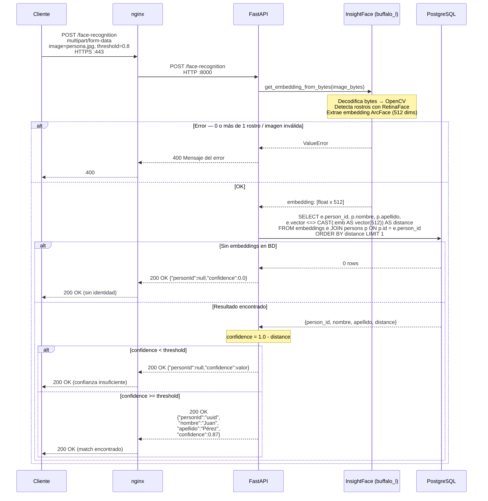
```mermaid
sequenceDiagram
    participant C as Cliente
    participant N as nginx
    participant F as FastAPI
    participant IF as InsightFace (buffalo_l)
    participant DB as PostgreSQL

    C->>N: POST /face-recognition<br/>multipart/form-data<br/>image=persona.jpg, threshold=0.8<br/>HTTPS :443
    N->>F: POST /face-recognition<br/>HTTP :8000

    F->>IF: get_embedding_from_bytes(image_bytes)
    Note over IF: Decodifica bytes → OpenCV<br/>Detecta rostros con RetinaFace<br/>Extrae embedding ArcFace (512 dims)

    alt Error — 0 o más de 1 rostro / imagen inválida
        IF-->>F: ValueError
        F-->>N: 400 Mensaje del error
        N-->>C: 400
    else OK
        IF-->>F: embedding: [float x 512]

        F->>DB: SELECT e.person_id, p.nombre, p.apellido,<br/>e.vector <=> CAST(:emb AS vector(512)) AS distance<br/>FROM embeddings e JOIN persons p ON p.id = e.person_id<br/>ORDER BY distance LIMIT 1

        alt Sin embeddings en BD
            DB-->>F: 0 rows
            F-->>N: 200 OK {"personId":null,"confidence":0.0}
            N-->>C: 200 OK (sin identidad)
        else Resultado encontrado
            DB-->>F: {person_id, nombre, apellido, distance}
            Note over F: confidence = 1.0 - distance

            alt confidence < threshold
                F-->>N: 200 OK {"personId":null,"confidence":valor}
                N-->>C: 200 OK (confianza insuficiente)
            else confidence >= threshold
                F-->>N: 200 OK<br/>{"personId":"uuid",<br/>"nombre":"Juan",<br/>"apellido":"Pérez",<br/>"confidence":0.87}
                N-->>C: 200 OK (match encontrado)
            end
        end
    end
```

---

## Auth.1 — POST /auth/register

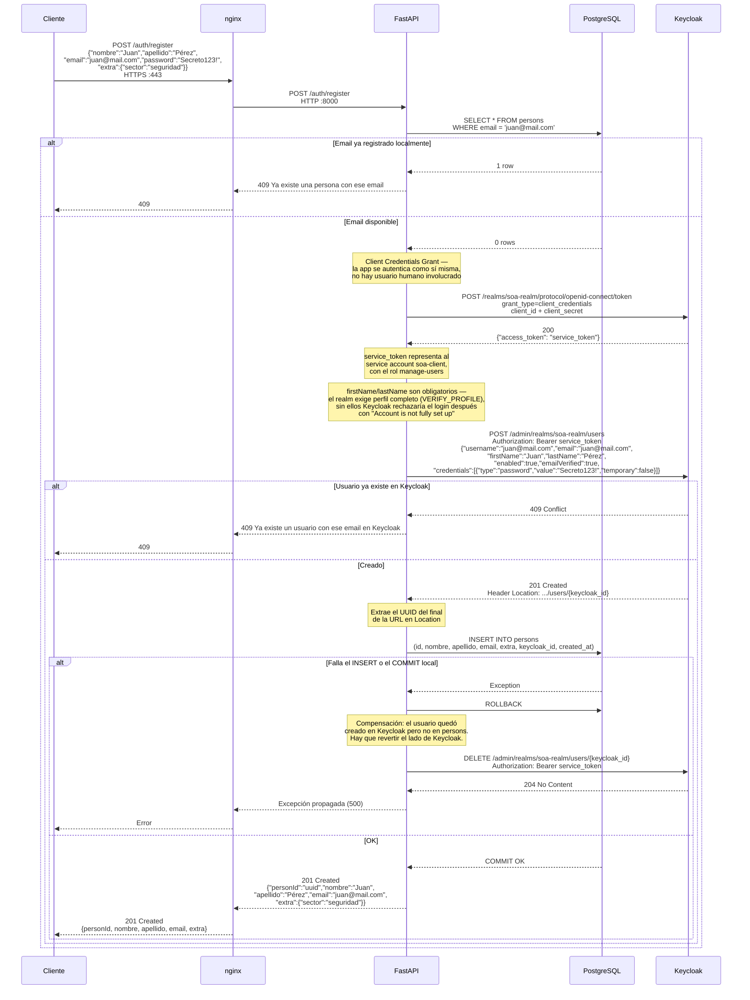
```mermaid
sequenceDiagram
    participant C as Cliente
    participant N as nginx
    participant F as FastAPI
    participant DB as PostgreSQL
    participant KC as Keycloak

    C->>N: POST /auth/register<br/>{"nombre":"Juan","apellido":"Pérez",<br/>"email":"juan@mail.com","password":"Secreto123!",<br/>"extra":{"sector":"seguridad"}}<br/>HTTPS :443
    N->>F: POST /auth/register<br/>HTTP :8000

    F->>DB: SELECT * FROM persons<br/>WHERE email = 'juan@mail.com'

    alt Email ya registrado localmente
        DB-->>F: 1 row
        F-->>N: 409 Ya existe una persona con ese email
        N-->>C: 409
    else Email disponible
        DB-->>F: 0 rows

        Note over F: Client Credentials Grant —<br/>la app se autentica como sí misma,<br/>no hay usuario humano involucrado

        F->>KC: POST /realms/soa-realm/protocol/openid-connect/token<br/>grant_type=client_credentials<br/>client_id + client_secret
        KC-->>F: 200<br/>{"access_token": "service_token"}

        Note over F: service_token representa al<br/>service account soa-client,<br/>con el rol manage-users

        Note over F: firstName/lastName son obligatorios —<br/>el realm exige perfil completo (VERIFY_PROFILE),<br/>sin ellos Keycloak rechazaría el login después<br/>con "Account is not fully set up"

        F->>KC: POST /admin/realms/soa-realm/users<br/>Authorization: Bearer service_token<br/>{"username":"juan@mail.com","email":"juan@mail.com",<br/>"firstName":"Juan","lastName":"Pérez",<br/>"enabled":true,"emailVerified":true,<br/>"credentials":[{"type":"password","value":"Secreto123!","temporary":false}]}

        alt Usuario ya existe en Keycloak
            KC-->>F: 409 Conflict
            F-->>N: 409 Ya existe un usuario con ese email en Keycloak
            N-->>C: 409
        else Creado
            KC-->>F: 201 Created<br/>Header Location: .../users/{keycloak_id}
            Note over F: Extrae el UUID del final<br/>de la URL en Location

            F->>DB: INSERT INTO persons<br/>(id, nombre, apellido, email, extra, keycloak_id, created_at)

            alt Falla el INSERT o el COMMIT local
                DB-->>F: Exception
                F->>DB: ROLLBACK
                Note over F: Compensación: el usuario quedó<br/>creado en Keycloak pero no en persons.<br/>Hay que revertir el lado de Keycloak.
                F->>KC: DELETE /admin/realms/soa-realm/users/{keycloak_id}<br/>Authorization: Bearer service_token
                KC-->>F: 204 No Content
                F-->>N: Excepción propagada (500)
                N-->>C: Error
            else OK
                DB-->>F: COMMIT OK
                F-->>N: 201 Created<br/>{"personId":"uuid","nombre":"Juan",<br/>"apellido":"Pérez","email":"juan@mail.com",<br/>"extra":{"sector":"seguridad"}}
                N-->>C: 201 Created<br/>{personId, nombre, apellido, email, extra}
            end
        end
    end
```

---

## Auth.2 — POST /auth/login

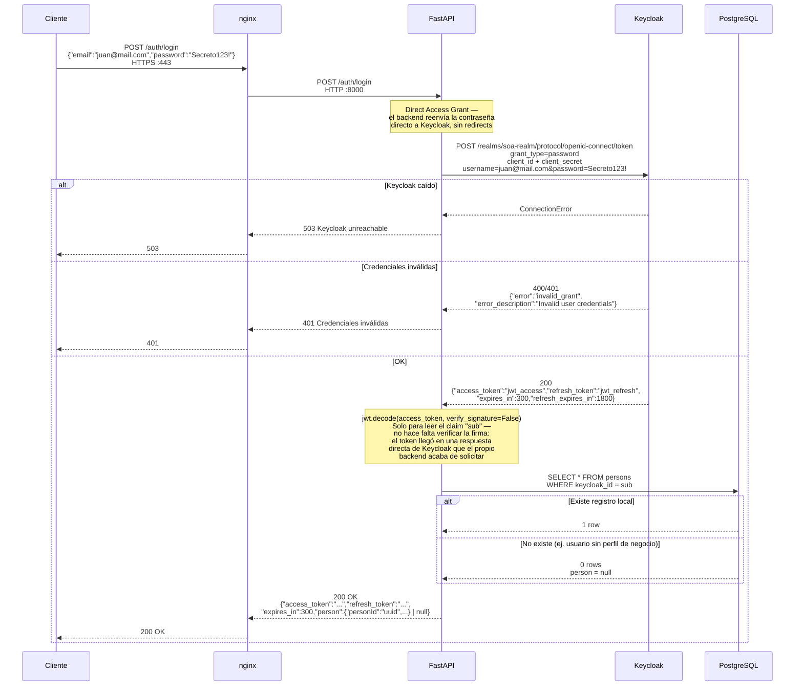
```mermaid
sequenceDiagram
    participant C as Cliente
    participant N as nginx
    participant F as FastAPI
    participant KC as Keycloak
    participant DB as PostgreSQL

    C->>N: POST /auth/login<br/>{"email":"juan@mail.com","password":"Secreto123!"}<br/>HTTPS :443
    N->>F: POST /auth/login<br/>HTTP :8000

    Note over F: Direct Access Grant —<br/>el backend reenvía la contraseña<br/>directo a Keycloak, sin redirects

    F->>KC: POST /realms/soa-realm/protocol/openid-connect/token<br/>grant_type=password<br/>client_id + client_secret<br/>username=juan@mail.com&password=Secreto123!

    alt Keycloak caído
        KC-->>F: ConnectionError
        F-->>N: 503 Keycloak unreachable
        N-->>C: 503
    else Credenciales inválidas
        KC-->>F: 400/401<br/>{"error":"invalid_grant",<br/>"error_description":"Invalid user credentials"}
        F-->>N: 401 Credenciales inválidas
        N-->>C: 401
    else OK
        KC-->>F: 200<br/>{"access_token":"jwt_access","refresh_token":"jwt_refresh",<br/>"expires_in":300,"refresh_expires_in":1800}

        Note over F: jwt.decode(access_token, verify_signature=False)<br/>Solo para leer el claim "sub" —<br/>no hace falta verificar la firma:<br/>el token llegó en una respuesta<br/>directa de Keycloak que el propio<br/>backend acaba de solicitar

        F->>DB: SELECT * FROM persons<br/>WHERE keycloak_id = sub

        alt Existe registro local
            DB-->>F: 1 row
        else No existe (ej. usuario sin perfil de negocio)
            DB-->>F: 0 rows<br/>person = null
        end

        F-->>N: 200 OK<br/>{"access_token":"...","refresh_token":"...",<br/>"expires_in":300,"person":{"personId":"uuid",...} | null}
        N-->>C: 200 OK
    end
```

---

## Auth.3 — POST /auth/refresh

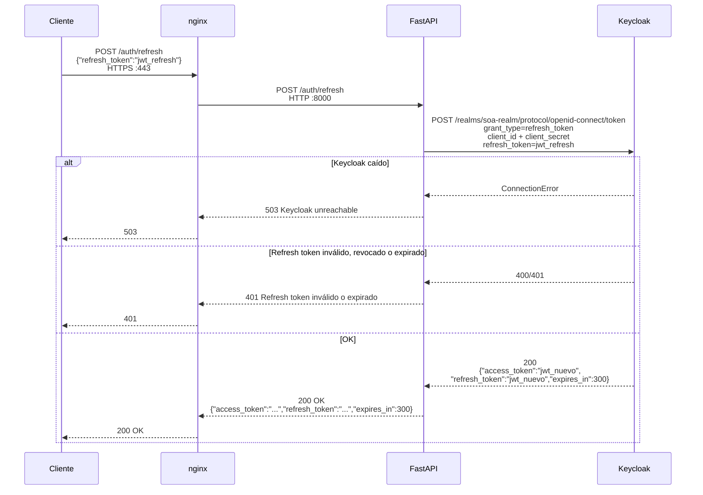
```mermaid
sequenceDiagram
    participant C as Cliente
    participant N as nginx
    participant F as FastAPI
    participant KC as Keycloak

    C->>N: POST /auth/refresh<br/>{"refresh_token":"jwt_refresh"}<br/>HTTPS :443
    N->>F: POST /auth/refresh<br/>HTTP :8000

    F->>KC: POST /realms/soa-realm/protocol/openid-connect/token<br/>grant_type=refresh_token<br/>client_id + client_secret<br/>refresh_token=jwt_refresh

    alt Keycloak caído
        KC-->>F: ConnectionError
        F-->>N: 503 Keycloak unreachable
        N-->>C: 503
    else Refresh token inválido, revocado o expirado
        KC-->>F: 400/401
        F-->>N: 401 Refresh token inválido o expirado
        N-->>C: 401
    else OK
        KC-->>F: 200<br/>{"access_token":"jwt_nuevo",<br/>"refresh_token":"jwt_nuevo","expires_in":300}
        F-->>N: 200 OK<br/>{"access_token":"...","refresh_token":"...","expires_in":300}
        N-->>C: 200 OK
    end
```

---

## Validación de JWT en un endpoint protegido (aplica a S1, S2, S3, S4 y S5)

Desde que se agregó Auth, **todos** los endpoints de S1 a S5 quedaron detrás de esta validación — se ejecuta automáticamente antes de cualquiera de ellos, vía `dependencies=[Depends(get_current_user)]` a nivel de cada `APIRouter`. Este diagrama reemplaza, como primer paso, a cualquiera de los diagramas anteriores de S1-S5: la request solo llega al flujo específico de cada endpoint si pasa esta validación.

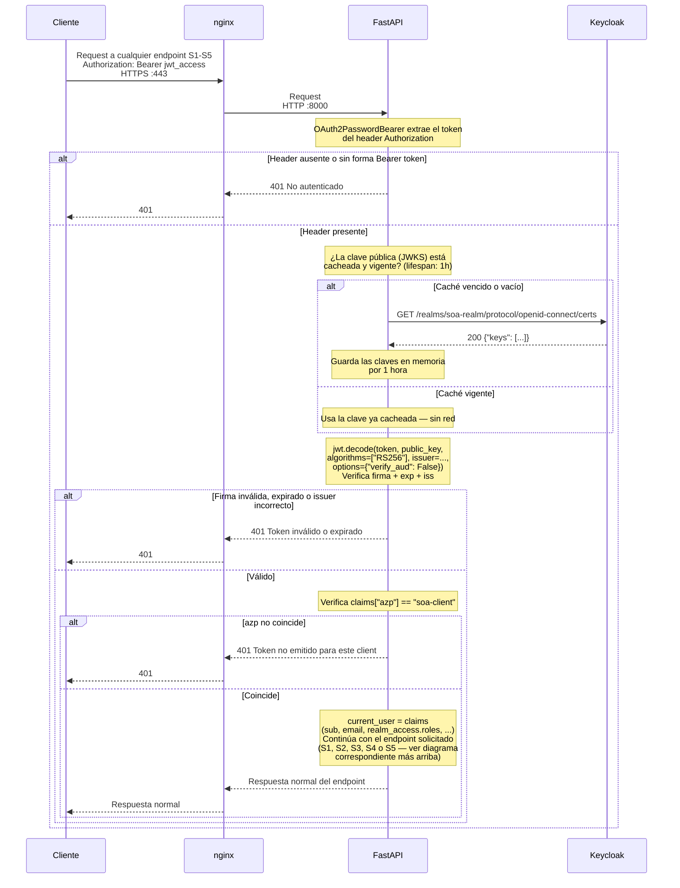
```mermaid
sequenceDiagram
    participant C as Cliente
    participant N as nginx
    participant F as FastAPI
    participant KC as Keycloak

    C->>N: Request a cualquier endpoint S1-S5<br/>Authorization: Bearer jwt_access<br/>HTTPS :443
    N->>F: Request<br/>HTTP :8000

    Note over F: OAuth2PasswordBearer extrae el token<br/>del header Authorization

    alt Header ausente o sin forma Bearer token
        F-->>N: 401 No autenticado
        N-->>C: 401
    else Header presente
        Note over F: ¿La clave pública (JWKS) está<br/>cacheada y vigente? (lifespan: 1h)

        alt Caché vencido o vacío
            F->>KC: GET /realms/soa-realm/protocol/openid-connect/certs
            KC-->>F: 200 {"keys": [...]}
            Note over F: Guarda las claves en memoria<br/>por 1 hora
        else Caché vigente
            Note over F: Usa la clave ya cacheada — sin red
        end

        Note over F: jwt.decode(token, public_key,<br/>algorithms=["RS256"], issuer=...,<br/>options={"verify_aud": False})<br/>Verifica firma + exp + iss

        alt Firma inválida, expirado o issuer incorrecto
            F-->>N: 401 Token inválido o expirado
            N-->>C: 401
        else Válido
            Note over F: Verifica claims["azp"] == "soa-client"

            alt azp no coincide
                F-->>N: 401 Token no emitido para este client
                N-->>C: 401
            else Coincide
                Note over F: current_user = claims<br/>(sub, email, realm_access.roles, ...)<br/>Continúa con el endpoint solicitado<br/>(S1, S2, S3, S4 o S5 — ver diagrama<br/>correspondiente más arriba)
                F-->>N: Respuesta normal del endpoint
                N-->>C: Respuesta normal
            end
        end
    end
```

---

## Monitoreo — Métricas de la PC local (Telegraf en Docker)

Telegraf de la PC local (`bruno_telegraf`, container aparte en `inference_service/docker-compose.yml`) — independiente del Telegraf de la VM, pero escribe al mismo InfluxDB, distinguido por el tag `host=bruno-pc`.

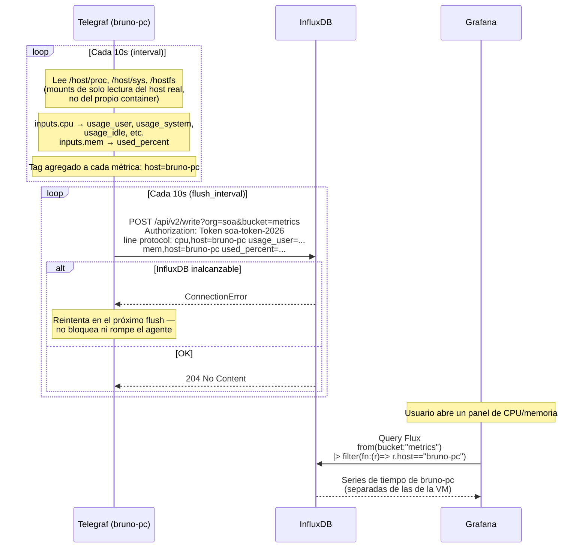
```mermaid
sequenceDiagram
    participant TB as Telegraf (bruno-pc)
    participant IDB as InfluxDB
    participant G as Grafana

    loop Cada 10s (interval)
        Note over TB: Lee /host/proc, /host/sys, /hostfs<br/>(mounts de solo lectura del host real,<br/>no del propio container)
        Note over TB: inputs.cpu → usage_user, usage_system,<br/>usage_idle, etc.<br/>inputs.mem → used_percent
        Note over TB: Tag agregado a cada métrica: host=bruno-pc
    end

    loop Cada 10s (flush_interval)
        TB->>IDB: POST /api/v2/write?org=soa&bucket=metrics<br/>Authorization: Token soa-token-2026<br/>line protocol: cpu,host=bruno-pc usage_user=...<br/>mem,host=bruno-pc used_percent=...

        alt InfluxDB inalcanzable
            IDB-->>TB: ConnectionError
            Note over TB: Reintenta en el próximo flush —<br/>no bloquea ni rompe el agente
        else OK
            IDB-->>TB: 204 No Content
        end
    end

    Note over G: Usuario abre un panel de CPU/memoria
    G->>IDB: Query Flux<br/>from(bucket:"metrics")<br/>|> filter(fn:(r)=> r.host=="bruno-pc")
    IDB-->>G: Series de tiempo de bruno-pc<br/>(separadas de las de la VM)
```

**URL de InfluxDB en `[[outputs.influxdb_v2]]`**: en pruebas locales (estado actual) es `http://host.docker.internal:8086` — el host de desarrollo simula a la VM. Al desplegar de verdad, se reemplaza por la IP de Tailscale real de la VM (ej. `http://100.112.249.84:8086`).

---

